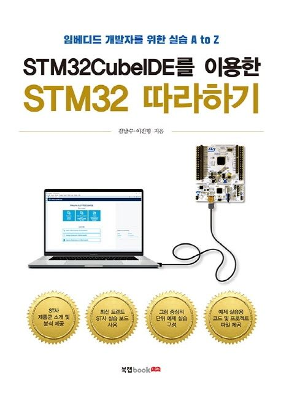

  
<h1 align="center">
  
STM32CubeIDE를 이용한 STM32 따라하기

  
</h1>
  

<b>김남수 · 이진형 저</b> 
북랩 · 2020년 6월 17일 출시 
[[예제 코드](https://cafe.naver.com/androiddaq)] | [[깃허브](https://github.com/dauera80/stm32atoz)]</b> 

## :bulb: 목표

- **MCU 기반 개발 환경에 익숙해지기.**

  > MCU 보드를 사용한 개발 예제 수행해 보기.
 

## 🚩 정리한 문서 목록

### 🔨 STM32CubeIDE 튜토리얼

 - [LED Blink](https://github.com/erectbranch/STM32_Basic/tree/master/ch03)

   > STM32CubeIDE project 생성, LED Blink 예제 수행, 시리얼 통신

### 🤖 X-CUBE-AI

 - [MNIST 튜토리얼](https://github.com/erectbranch/STM32_Basic/tree/master/X-CUBE-AI)

   > X-CUBE-AI를 이용한 MNIST 예제 구현하기

 

## :mag: 목차

### 1. STM32 요약

    1.1. STMicroelectronics STM32 현황 12

    1.2. STM32 32-bit MCU Family 소개 14

    1.3. STM32 개발 보드 종류 29

    1.4. STM32 에코 시스템 31

### 2. 개발 환경 구축

    2.1. 실습 보드 소개 36

    2.2. STM32CubeIDE 설치 45

    2.3. 터미널 통신 프로그램 설치 66

### 3. STM32CubeIDE 프로젝트 시작하기

    3.1. LED Blink 76

    3.2. printf 시리얼 디버깅 100

### 4. Peripheral 예제

    4.1. EXTI 120

    4.2. TIM_TimeBase 138

    4.3. ADC 153

    4.4. WWDG 171

    4.5. USART 180

    4.6. TIM_PWM 195

### 5. NUCLEOEVB 보드를 이용한 실습

    5.1. GPIO 209

    5.2. EXTI 226

    5.3. ADC 249

    5.4. TIM 279

    5.5. I2C 310

    5.6. SPI 341

    5.7. CLCD 353

    5.8. Application 370
