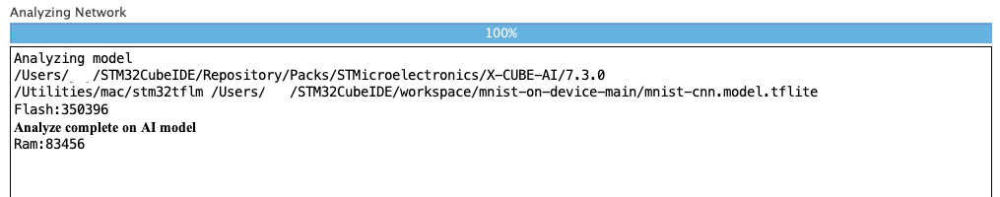

# 6 X-CUBE-AI: MNIST model 추론하기

MNIST model을 STM32F746G-DISCO 보드에 배포하고 실행할 것이다.

AI model을 TFLM용으로 변환하는 과정은 TinyML github 정리를 참조한다.

> [TinyML_Basic](https://github.com/erectbranch/TinyML_Basic): ch04 참조

또한 [STM32CubeIDE용 compiler 설정](https://fastbitlab.com/microcontroller-embedded-c-programming-lecture-54-compiler-settings-on-stm32cubeide/)을 미리 진행해야 error 없이 빌드가 가능하다. 

> [Arm GNU Toolchain 다운로드](https://developer.arm.com/downloads/-/gnu-rm)

---

## 6.1 X-CUBE-AI 설치

TFLM으로 변환한 AI model을 간편하게 기기에 배포할 수 있는 X-CUBE-AI를 설치해 보자.

설치 전 ST사에서 제공하는 AI expansion pack을 추가로 설치해야 한다. 

> [AI expansion pack for STM32CubeMX](https://www.st.com/en/embedded-software/x-cube-ai.html): 이름, 이메일, 이메일 확인 필요

1. Software Packs 확인

[File] - [New] - [STM32 Project]으로 새 project를 만든 뒤, 배포할 기기를 선택한다.

    

그 다음 Pinout & Configuration 바로 아래 <Software Packs>를 누르면 Select Components를 선택할 수 있다.

2. STMicroelectronics.X-CUBE-AI 설치

    

STMicroelectronics.X-CUBE-AI에 해당되는 software pack을 [Install] 버튼을 눌러 설치한다.

3. STMicroelectronics.X-CUBE-AI 활성화

    

설치가 끝났으면 현재 목록에서 S[STMicroelectronics.X-CUBE-AI] - [Artificial Intelligence X-CUBE-AI] - [Core]의 박스를 눌러 체크 상태로 변경한다.

그리고 우측 하단의 [Ok] 버튼을 누르면 AI expansion pack이 설치된 경로를 찾는 팝업이 뜬다. 설치한 경로를 선택해 준다.

4. 좌측 [Software Packs] 메뉴에서 X-CUBE-AI 활성화

    

설치가 마무리되었으면 좌측에 Software Packs 메뉴가 새로 생기게 된다. STMicroelectrics.X-CUBE-AI.{버전}을 누르고 우측의 박스를 체크 상태로 만든다.

이제 [Ctrl] + [S]를 눌러 저장하거나, [Project] - [Generate Code]를 누르면 workspace에서 작업을 수행할 수 있다.

---

## 6.2 MNIST model 배포하기

---

## 6.2.1 Model import, analyze

> [MNIST model](https://github.com/erectbranch/mnist-on-device): 튜토리얼, 모델 파일 다운로드

workspace를 보면 좌측에 X-CUBE-AI 디렉터리가 새로 추가된 것을 확인할 수 있다.


하지만 현재는 AI model을 배포하지 않았으므로 [App] 디렉터리만 존재한다. model을 기기에 배포하기 위해서는, 우선 우측 상단의 [MX] icon을 눌러서 다시 X-CUBE-AI 설정으로 돌아온다.


좌측의 [Software Packs] 메뉴를 누르면 다시 X-CUBE-AI Configuration을 볼 수 있다.


파란색 [Add network] 버튼을 누르면 추가할 model에 해당되는 정보를 선택해 준다.

> keras, TFLite, ONNX(PyTorch, MATLAB 등)를 선택할 수 있다.

> [PyTorch 모델을 ONNX으로 변환하고 ONNX 런타임에서 실행하기](https://tutorials.pytorch.kr/advanced/super_resolution_with_onnxruntime.html)


- TFLite 변환 model을 사용할 것이기 때문에 [TFLite], [TFLite Micro Runtime]을 선택한다.

  > 'STM32Cube.AI runtime'은 STMicroelectronics에서 제공하는 STM32 MCU를 위한 AI application runtime이다. 'TFLite Micro runtime'은 구글에서 제공하는 embedded device용 가벼운 TensorFlow Lite runtime이다. 

  > 두 가지 runtime 모두 AI 모델을 임베디드 기기에서 실행하는데 사용된다.  하지만 STM32Cube.AI runtime은 STM32 MCU에 좀 더 특화된 최적화를 지원한다.

- Model: [Browse...] 버튼을 눌러 model을 불러온다.(.tflite 파일)

    

변환된 model에 해당되는 .tflite 파일을 제대로 불러오면, 하단의 [Analyze] 버튼이 활성화된다. 클릭해서 model의 정보를 확인한다.

> [STM32Cube.AI: Analyze 기능을 이용한 분석 예제](https://make.e4ds.com/contest/contest_quest.asp?ctidx=7&step=1)



- Flash: TFLite Micro model을 저장하는 공간으로 쓰인다. (일반적으로 embedded system에서 model은 flash memory에 저장된다.)

- RAM: TensorFlow Lite Micro가 실행되는 공간이다. 일반적으로 RAM은 model을 실행하는데 필요한 tensor, model 구성 요소 및 작업 buffer를 저장하는데 사용됩니다

- inference 과정에서는 input tensor와 필요한 여러 data를 flash에서 RAM으로 load하고, inference가 수행된 뒤 output은 RAM에 저장된다.

그러면 Flash, Ram 사용량을 알아서 분석해서 도출해 준다.(단위는 byte)

> 따라서 kB(1kB = 1000 bytes)로 나타내면 Flash는 약 350kB, Ram은 약 83kB를 사용한다.

이제 다시 [Ctrl] + [S]를 눌러 저장하면 model이 project로 import된다.

> model을 불러온 뒤 `tflite::PrintInterpreterState()`를 사용하는 것으로 tensor size와 memory 요구량을 알아내는 방법도 존재한다.

---

### 6.2.2 model 배포하기

성공적으로 model을 가져왔다면 [X-CUBE-AI] - [App] 디렉터리 안에 여러 파일이 생성된 것을 확인할 수 있다. 이들은 .tflite로 변환된 model과, TFLite Micro runtime source(즉, Pack의 Middleware/tensorflow 콘텐츠)에 해당된다.(c file로 변환된 버전)

> Middlewares/tensorflow/tensorflow/lite/micro/kernels/cmsis_nn/을 보면 model에서 사용되는 연산(add, conv, mul, softmax, pooling 등)들의 최적화 과정을 확인할 수 있다.


- network.c: model에 해당되는 .tflite 파일의 16진수 dump를 포함하는 'g_tflm_network_model_data' array가 적혀 있다.

  

- tflm.c.cc: TFLite library가 C++ 형태로 정리되어 있다.

  

model inference를 위해서는 'debug_log_imp.cc' 파일에 `tflm_io_write()` method를 추가해 줘야 한다. `tflm_io_write()`는 TFLite Micro debug output을 출력하기 위해 구현하는 method다.

지금은 간단히 return 0만 적어둔다.

```cpp
int tflm_io_write(const void *buff, uint16_t count) {
  return 0;
}
```

---

## 6.3 Inference 실행 및 Event 처리


기기에 model 배포가 마무리되었으므로 inference를 실행할 차례다. infenrence를 보드에서 확인하기 위해서는, 우선 [Core] - [Src] 디렉터리에 'tasks.c' 파일을 만들어서 inference를 어떻게 처리할지 규정해야 한다.

> tasks.c 파일은 main.cc와 main_functions.cc, output_handler.cc 등에서 정의한 기능들을 합친 code에 가깝다. [TFLite model project 구조](https://github.com/erectbranch/TinyML_Basic/tree/master/ch05/summary02) 참조.

MNIST inference의 'tasks.c' 파일을 살펴보자. 앞서 본 'tflm_c.h', 'network_tflite_data.h'를 include해서, tflm과 관련된 function들과 model 정보가 담긴 'g_tflm_network_model_data'를 사용한다.

```c
#include <stdio.h>
#include <stdarg.h>
#include "cmsis_os.h"
#include "stm32746g_discovery_lcd.h"
#include "stm32746g_discovery_ts.h"

#include "tflm_c.h"
#include "network_tflite_data.h"

// ...

volatile int displayInitialized = 0;
volatile int eventButtonTouched = 0;
```

'stm32746g_discovery_lcd.h'와 'stm32746g_discovery_ts.h'는 STM32F7 펌웨어를 설치했을 때, '/Users/xxx/STM32Cube/Repository/STM32Cube_FW_F7_V1.7.0/Drivers/BSP' 디렉터리에 함께 설치되어 있을 것이다. 

project에 ../Drivers/BSP 디렉터리를 만든 뒤, 펌웨어와 함께 설치된 [Components]와 [STM32746G-Discovery]를 복사해서 붙여넣는다.


> [터치 스크린 작동을 위한 I2C 추가](https://m.blog.naver.com/kiatwins/221024367479)

이렇게 header를 추가했다면 compiler가 해당 경로를 탐색하도록 업데이트해야 한다. [File] - [Properties] - [C/C++ Build] - [Setting]를 클릭하면 [Tool Settings] 탭에 MCU GCC Compiler가 쓰인 메뉴가 나타난다.


[MCU GCC Compiler] - [Include paths]를 누른 뒤  버튼을 눌러서 다음 경로를 추가해 준다.

```
../Drivers/BSP/Components
../Drivers/BSP/STM32746G-Discovery
```

또한 font도 추가해 줘야 한다. '/Users/xxx/STM32Cube/Repository/STM32Cube_FW_F7_V1.7.0/Utilities/Fonts'에 위치해 있다. 이를 project에 ../Utilities/Fonts/ 디렉터리를 만든 뒤 붙여넣는다.


> 만약 [MCU G++ linker error](https://www.openstm32.org/forumthread2449)가 발생한다면, [File] - [Properties] - [C/C++ Build] - [Setting]의 [Tool Settings] 탭에서 [MCU GCC Linker] - [Miscellaneous]에 있는 flags에 '-specs=nano.specs -specs=nosys.specs'를 [추가](https://stackoverflow.com/questions/65453293/what-are-nosys-nano-rdimon-terms-when-using-arm-gcc)해 준다.(Reduced C library를 사용한다는 의미다.)

```
-specs=nano.specs -specs=nosys.specs
```

> 만약 [nano.specs]와 관련된 error가 발생하면 [해당 문서](https://siliconlabs.force.com/community/s/article/problems-with-c-library-inclusion-in-mbed-project-imported-into-simplicity-studi?language=en_US)를 참조한다. GNU ARM C++ Linker를 'Base C Library'로 바꾼다.

---

### 6.3.1 LCD 입력 영역/버튼 영역/문자열 표시

다음으로 여러 macro, variable 정의 다음에 나오는 `printlog()` function을 살펴보자. `printlog()`에서는 log buffer를 만든 뒤 `BSP_LCD_DisplayStringAtLine` function을 이용해 LCD 디스플레이 특정 지점에 문자열을 표시한다.

- BSP_LCD_DisplayStringAt(uint16_t Xpos, uint16_t Ypos, uint8_t *pText, Text_AlignModeTypdef Mode);

  - pText : 표시할 문자열

  - Xpos : 문자열을 표시할 X 좌표

  - Ypos : 문자열을 표시할 Y 좌표

  - Mode : 문자열 정렬 모드 (LEFT, RIGHT, CENTER)

> `BSP_LCD_SetBackColor`나 `BSP_LCD_SetTextColor`으로 문자열 배경색이나 글자색을 설정할 수도 있다.

```c
#define LOG_BUFFER_SIZE 32
void printlog(const char* format, ...) {
  // display 초기화가 되지 않았다면 수행하지 않는다.
  if (!displayInitialized) {
    return;
  }
  
  // 문자열을 저장할 가변인자 리스트를 선언하고 va_start로 초기화한다.
  // va_list: 가변인자 리스트를 가리키는 pointer
  va_list args;
  va_start(args, format);

  // 버퍼를 선언한 뒤 vsprintf()를 이용해 '가변인자 리스트에 formatting된 문자열을 생성'한다.
  // vsprintf()를 사용할 때 buffer size를 넘게 되면 문제가 생기므로 주의해서 사용해야 한다.
  uint8_t buffer[LOG_BUFFER_SIZE];
  vsprintf((char *)buffer, format, args);

  // 버퍼에 공백을 넣어서 초기화
  int i = 0;
  while (buffer[i] != '\0' && i < LOG_BUFFER_SIZE) i++;   // buffer index 끝에 도달하기 전까지(혹은 설정한 log_buffer_size만큼 값이 늘기 전까지) i++
  while (i < LOG_BUFFER_SIZE) {
    buffer[i] = ' ';
    i++;
  }
  buffer[LOG_BUFFER_SIZE - 1] = '\0';    // 마지막은 NULL을 넣어서 문자열의 끝임을 나타낸다.

  // LCD 디스플레이 위에 buffer에 저장된 문자열을 출력한다.
  // BSP_LCD_DisplayStringAtLine(uint16_t line, uint8_t*)
  // (1,(uint8_t*) "hi") 식으로 간단한 문자열을 출력할 수도 있다.
  BSP_LCD_DisplayStringAtLine(10, buffer);

  // 가변인자 리스트 사용 후 va_end()로 꼭 종료해야 한다.
  va_end(args);
}
```

다음은 `tflm_io_write()` function을 다시 정의해 준다. 현재는 따로 debug를 위한 출력을 처리하지 않을 것이므로 간단히 return 0만 적는다.

```c
int tflm_io_write(const void *buff, uint16_t count) {
  return 0;
}
```

이제 inference로 도출된 output을 LCD에 표시하는 `TchDspTask()`를 정의한다.

```c
void TchDspTask(void const * argument) {
  // LCD 초기화
  BSP_LCD_Init();
  BSP_LCD_LayerDefaultInit(0, LCD_FB_START_ADDRESS);
  BSP_LCD_SelectLayer(0);
  BSP_LCD_DisplayOn();
  BSP_LCD_Clear(LCD_COLOR_BLACK);
  BSP_LCD_SetTextColor(LCD_COLOR_WHITE);
  BSP_LCD_SetBackColor(LCD_COLOR_BLACK);
  displayInitialized = 1;

  // Touch Screen 초기화
  uint32_t screenSizeX = BSP_LCD_GetXSize();
  uint32_t screenSizeY = BSP_LCD_GetYSize();
  BSP_TS_Init(screenSizeX, screenSizeY);

  // 사각형 영역을 그린다.
  // input을 그리기 위한 사각형 영역, inference 실행 명령을 위한 버튼 영역
  BSP_LCD_DrawRect(
    DRAW_AREA_X - 1, DRAW_AREA_Y - 1,
    DRAW_AREA_WIDTH + 1, DRAW_AREA_HEIGHT + 1
  );
  BSP_LCD_DrawRect(
    BTN_AREA_X - 1, BTN_AREA_Y - 1,
    BTN_AREA_WIDTH + 1, BTN_AREA_HEIGHT + 1
  );

  TS_StateTypeDef ts;    // STM에서 touch 반응을 구현하기 위한 struct(Touch Sensing Library에 구현되어 있다.)
  int flagDrawing = 1;
  uint16_t xpos = 0, ypos = 0, pxpos = 0, pypos = 0;

  //...
```

---

### 6.3.2 touch event 처리

이어서 보자. 이제 LCD상의 touch event 처리를 정의한다. infinite loop로 구현하여 touch event가 발생할 때마다 처리하도록 구현한다.

앞서 선언한 variable 'flagDrawing'과 'eventButtonTouched'를 이용해, input을 그리는 영역과 inference를 실행하는 버튼 영역의 이벤트 처리를 구분짓는다.

- 'flagDrawing': touch event가 발생하지 않으면 1, 발생하면 0의 값을 갖는다.

- 'eventButtonTouched': global variable로 inference 버튼을 누르면 1의 값을 갖는다. inference가 끝나고 output 출력까지 끝나면 다시 0으로 돌아온다.

- `BSP_TS_GetState()`: touch sensor의 state를 읽는다. touch sensor의 터치 이벤트 발생 여부, 얼마나 터치되었는지 등을 확인할 수 있다.(`TS_StateTypeDef` type struct를 인자로 받는다.)

```c
  for (;;) {
    // 터치 이벤트를 확인하기 위한 BSP_TS_GetState 함수
    // 앞서 정의한 struct를 인자로 준다.
    BSP_TS_GetState(&ts);

    // 터치가 발생했다면
    if (ts.touchDetected) {
      // 터치 지점의 x, y position(xpos, ypos)을 가져온다.
      xpos = ts.touchX[0] & 0xFFF;
      ypos = ts.touchY[0] & 0xFFF;

      // 터치가 drawing area 영역에서 발생했다면
      if ((DRAW_AREA_X < xpos && xpos < (DRAW_AREA_X + DRAW_AREA_WIDTH)) &&
          (DRAW_AREA_Y < ypos && ypos < (DRAW_AREA_Y + DRAW_AREA_HEIGHT))) {
        if (flagDrawing) {
          flagDrawing = 0;
        } else {
          // drawing lines (for continuous drawing)
          BSP_LCD_DrawLine(pxpos, pypos, xpos, ypos);
        }

        pxpos = xpos, pypos = ypos;
      }

      // 터치가 inference 버튼(action area) 영역에서 발생했다면
      if ((BTN_AREA_X < xpos && xpos < (BTN_AREA_X + BTN_AREA_WIDTH)) &&
          (BTN_AREA_Y < ypos && ypos < (BTN_AREA_Y + BTN_AREA_HEIGHT))) {
        eventButtonTouched = 1;
      }
    } else {    
      // 터치가 발생하지 않은 상태에서는
      // flagDrawing = 1로 둔다.
      flagDrawing = 1;
    }
  }
}
```

---

### 6.3.3 inference 실행

이제 touch event 처리도 완료했다. LCD의 inference 버튼 영역을 눌러 'eventButtonTouched' variable이 1이 되었을 때, inference를 실행하도록 code를 작성하면 된다. 이제 inference를 정의하는 `InferenceTask`를 보자.

앞서 X-CUBE-AI/App/[tflm_c.cc](https://github.com/erectbranch/mnist-on-device/blob/main/X-CUBE-AI/App/tflm_c.cc)에서 `tflm_c_create()`의 정의를 볼 수 있었다. TensorFlow Lite Micro 인스턴스를 생성하고 memory를 allocate하는 등의 기능을 했다. 

- 'TENSOR_ARENA_SIZE'는 model inference 과정에서 필요한 (RAM) memory space의 크기를 의미한다. model size와 input tensor size, 그리고 inference 작업에 필요한 memory space를 고려하여 설정한다.

> 따라서 앞서 analyze로 본 RAM 사용량을 기준으로 size를 결정할 수는 있으나, inference 작업에서 다른 요인으로 쓰이는 memory(LCD 표시, event 처리 등)를 고려해서 예제에서는 우선 flash memory size만큼 할당했다. 이를 `tflm_c_create()`로 넘겨준다.

```c
#define TENSOR_ARENA_SIZE 83456

void InferenceTask(void const * argument) {
  // LCD가 아직 초기화가 되지 않았다면 더 기다린다.
  while (!displayInitialized) osDelay(10);

  // hdl(hardware description language): hardware 구조를 설명하는 instruction들로 구성되어 있다.
  uint32_t hdl;
  static uint8_t tensor_arena[TENSOR_ARENA_SIZE];

  TfLiteStatus status = tflm_c_create(
      g_tflm_network_model_data,
      tensor_arena,
      TENSOR_ARENA_SIZE,
      &hdl
  );

  printlog("Model Ready: %d", status);

  struct tflm_c_tensor_info input_tensor;
  struct tflm_c_tensor_info output_tensor;

  volatile static uint8_t drawing_area[DRAW_AREA_HEIGHT][DRAW_AREA_WIDTH];
  volatile static uint8_t drawing_area_small[BTN_AREA_HEIGHT][BTN_AREA_WIDTH];

  uint32_t total_time = 0;
  uint32_t inference_time = 0;
```

참고로 위에서 선언한 `uint32_t` variable 'hdl'은 `tflm_c_create`에서 다음과 같이 정의된다. 

- hdl: hardware description language의 약자로, hardware 구조를 설명하는 instruction들로 구성된다.

- ctx: context의 약자로, 여기서는 hardware 설계를 수행하는 데 필요한 context 정보가 담긴 객체를 의미한다. 

  - ctx 객체의 `get_handle()` method를 이용해 해당 hardware 설계 객체를 접근할 수 있는 handle을 가져올 수 있다.

```cpp
*hdl = ctx->get_handle();
```

> `tflm_c_tensor_info` struct는 X-CUBE-AI/App/tflm_c.h header file에 정의되어 있다.

```cpp
struct tflm_c_tensor_info {
  TfLiteType type;      // data type (e.g. float32, uint8, ...)
  int32_t  idx;         // data index
  uint32_t batch;       // axis: 0
  uint32_t height;      // axis: 1
  uint32_t width;       // axis: 2
  uint32_t depth;       // axis: 3
  uint32_t extension;   // axis: 4
  uint32_t channels;    // axis: 5
  size_t   bytes;       // tensor data size
  float    scale;
  int      zero_point;
  void*    data;        // start address of tensor data
  struct tflm_c_shape shape;
};
```


InferenceTask code를 이어서 보자. infinite loop로 LCD의 inference 버튼 영역에서 touch event가 발생했을 때 inference가 시작된다.

우선 inference 버튼 영역을 눌러 inference를 시행하면, inference 버튼 영역에도 input으로 그린 그림을 scaling한 버전으로 표시할 것이다.

```c
  for (;;) {
    // LCD의 inference 버튼 영역에서 touch event가 발생했을 때 inference 시작
    if (eventButtonTouched) {
      // RTOS(Real-Time Operating System)에서 사용하는 system time을 측정
      total_time = osKernelSysTick();

      printlog("Getting Input Data ...");

      // input을 그리는 사각형 영역에 그려진 pixel을 읽는다.
      // BSP_LCD_ReadPixel(): LCD 디스플레이 특정 좌표의 색상을 읽어낸다.
      for (int i = 0; i < DRAW_AREA_HEIGHT; i++) {
        for (int j = 0; j < DRAW_AREA_WIDTH; j++) {
          drawing_area[i][j] = BSP_LCD_ReadPixel(DRAW_AREA_X + j, DRAW_AREA_Y + i);
        }
      }

      // inference 버튼 영역에 맞게 scaling하기 위해 크기 변수 선언
      int x_scale_factor = DRAW_AREA_WIDTH / BTN_AREA_WIDTH;
      int y_scale_factor = DRAW_AREA_HEIGHT / BTN_AREA_HEIGHT;

      // scaling 버전의 input 그림을 'drawing_area_small'에 담는다.
      for (int i = 0; i < DRAW_AREA_HEIGHT; i++) {
        for (int j = 0; j < DRAW_AREA_WIDTH; j++) {
          if (drawing_area[i][j]) {
            drawing_area_small[i / y_scale_factor][j / x_scale_factor] = 0xFF;
          }
        }
      }

      // scaling down 버전의 data를 이용해 inference 버튼 영역에 그린다.
      for (int i = 0; i < BTN_AREA_HEIGHT; i++) {
        for (int j = 0; j < BTN_AREA_WIDTH; j++) {
          int color = LCD_COLOR_BLACK;
          if (drawing_area_small[i][j]) {
            color = LCD_COLOR_WHITE;
          }
          BSP_LCD_DrawPixel(BTN_AREA_X + j, BTN_AREA_Y + i, color);
        }
      }

      printlog("Data Preprocessing ...");
```

inference 버튼 영역에 표시를 마쳤으므로 본격적인 inference를 실행한다.

- `tflm_c_input()` model에 input data를 전달하는 function. 일반적인 형식은 다음과 같다.

```c
tflm_c_input(tflm_c_model* model, const void* data, size_t data_size);
```

- `tflm_c_model* model`: TFLM model struct pointer

- `const void* data`: model에 전달할 input data

- `size_t data_size`: input data size

이렇게 input을 전달한 뒤 `tflm_c_invoke()`를 사용해서 inference를 실행한다. 참고로 inference는 0~9까지의 숫자만 추론하는 점을 이용해, for문의 index를 0~9까지 사용하여 LCD에 표시한다.

```c
      // 본격적인 inference
      // 1. tflm_c_input()를 이용해 input_tensor를 처리한다.
      // input_tensor.data pointer를 사용해서 작게 scaling한 data를 넣어준다.
      tflm_c_input(hdl, 0, &input_tensor);
      float *input = (float *)input_tensor.data;
      for (int i = 0; i < BTN_AREA_HEIGHT; i++) {
        for (int j = 0; j < BTN_AREA_WIDTH; j++) {
          input[BTN_AREA_HEIGHT * i + j] = drawing_area_small[i][j] / 255.0f;
        }
      }

      printlog("Inferring ...");

      // 2. tflm_c_invoke()로 inference를 수행한다.
      // osKernelSysTick()을 이용해서 inference에 소모된 시간을 저장한다.
      inference_time = osKernelSysTick();
      tflm_c_invoke(hdl);
      inference_time = osKernelSysTick() - inference_time;

      // 3. tflm_c_output()로 output_tensor를 처리한다.
      tflm_c_output(hdl, 0, &output_tensor);
      float *output = (float *)output_tensor.data;

      // output_tensor에 저장된 결과를 출력한다.
      // BSP_LCD_DisplayStringAt()를 사용해 우측에 inference output 확률을 출력하기 위해
      // result_str buffer를 만든다.
      // [0] : 0.02
      // [1] : 0.61
      // [2] : 0.03 ...식으로 표시된다.
      char result_str[32];
      for (int i = 0; i < 10; i++) {
        sprintf(result_str, "[%d]: %.2f", i, output[i]);
        BSP_LCD_DisplayStringAt(296, 10 + (20 * i), (uint8_t*)result_str, LEFT_MODE);
      }

      // output을 표시하기까지 걸린 total_time을 계산한다.
      total_time = osKernelSysTick() - total_time;

      // total_time(output 표시까지 걸린 시간)
      // inference_time(inference 수행에 걸린 시간)을 표시한다.
      printlog("%2.3fs(%2.3fs for Inference)",
          (float)total_time / osKernelSysTickFrequency,
          (float)inference_time / osKernelSysTickFrequency
      );

      eventButtonTouched = 0;
    }
  }
}
```

전체 수행 시간과 inference로 걸린 시간을 계산하기 위해 사용한 `osKernelSysTickFrequency()` function은 시스템 틱(SysTick)의 frequency를 반환한다. 다시 말해 1초에 발생한 clock tick을 반환한다. 따라서 `osKernelSysTick/osKernelSysTickFrequency`를 통해서 second 단위의 시간을 계산한다.

> 흔히 clock tick을 심장 박동에 비유한다. 예를 들어 100Hz의 경우 초당 100번 발생하므로 period는 10ms가 된다.(1s = 1000ms)

> scheduler를 주기적으로 호출할 수 있는 것도 바로 clock tick 덕분이다. 너무 많은 clock tick이 발생하면 interrupt handler를 수행하는 빈도가 높아져서 performance가 낮아지므로 적절한 수치를 설정하는 것이 중요하다.

---

## 6.4 타깃 보드에 다운로드하여 실행

상단의 [Run] - [Run] 메뉴(혹은 Run 아이콘)를 눌러 실행한다.

---