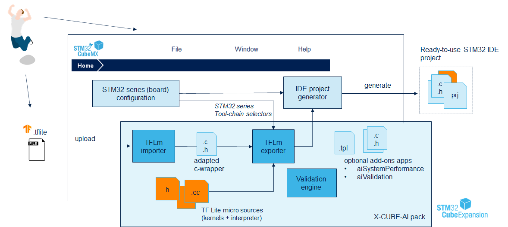
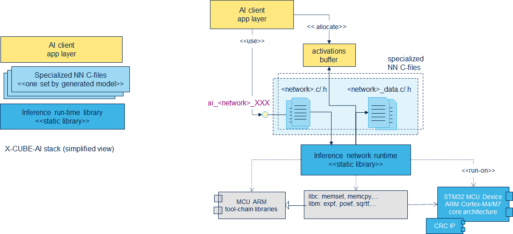
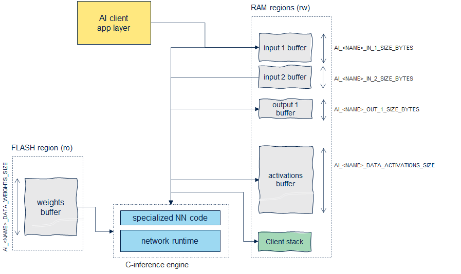
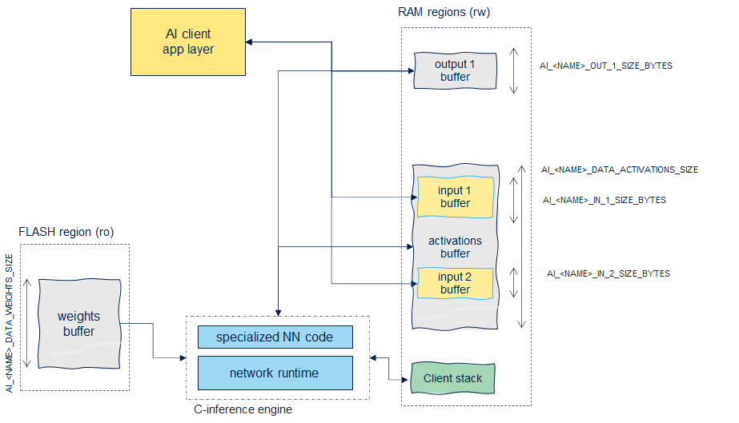
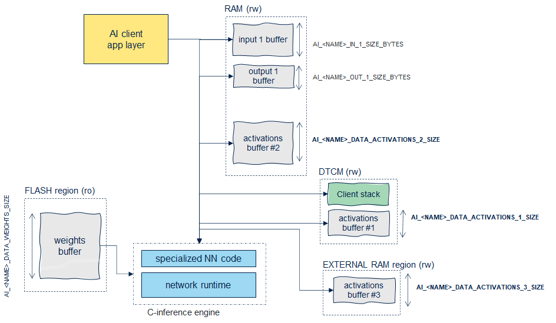
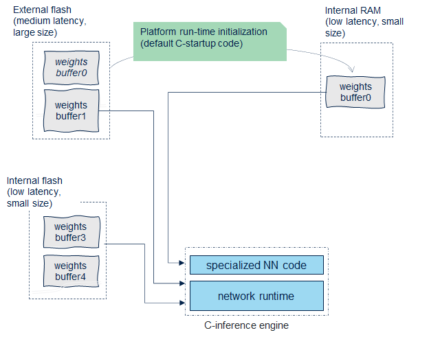
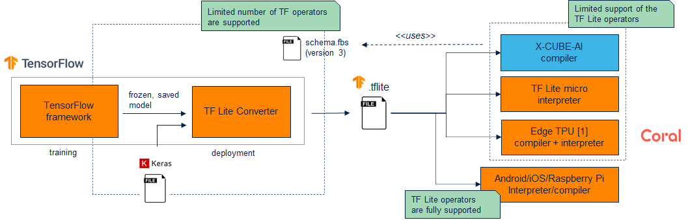
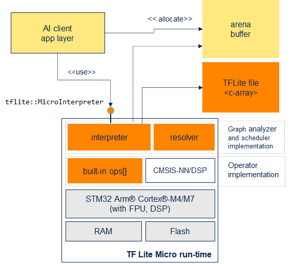
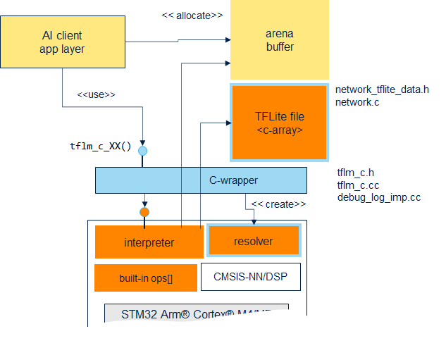

# X-CUBE-AI 확장 패키지: TFLM 설명

## 1 개요

> {User}/STM32CubeIDE/Repository/Packs/STMicroelectronics/X-CUBE-AI/7.3.0/Documentation/tflite_micro_support.html 설명 참조

X-CUBE-AI 확장 패키지는 TensorFlow Lite for Microcontrollers runtime(이 문서에서는 **TFLm** 이라고도 한다.) 및 TFLite model을 embedding하는 STM32 IDE project를 생성하기 이해 특정 path들을 통합한다.

그리고 다양한 middleware/driver와 TFLm interpreter, 관련된 kernel source를 포함하는 STM32 firmware를 구성한다.



- '.tflite' file을 업로드한다.

  - 이를 적절히 '.c', '.h' C code file로 재구성한다.(library .a)

- TFLite micro sources(kernels + interpreter)

> kernel: 시스템 운영을 위한 infra structure. system resource의 관리와 user program의 요청을 처리하는 역할. 여기서는 연산 구현 및 관련된 code가 담긴 inference runtime library를 의미한다.

- STM32 series Tool-chain(GNU Arm embedded tool-chain 등)을 사용해서 STM32 project를 생성한다.

---

## 1.1 embedded inference client API

inference를 실행하는 C-model 배포를 사용하기 위해서, 다음과 같이 embedded inference client API를 구성한다.

모든 model-specific definition과 inmplementation은 다음 C-file들에서 확인할 수 있다. `<name>.c`, `<name>.h`, `<name>_data.c`, `<name>_data.h`



---

## 1.2 data memory layout



- activations buffer: RAM(read/write 가능)에 배치되는 memory-mapped buffer. AI client에 의해 소유되며 allocate된다.

  - 따라서 inference 실행 중 private heap(또는 working buffer)로 사용된다.

  - `AI_<NAME>_DATA_ACTIVATIONS_SIZE`을 이용해서 size가 정의된다.

- input, output buffer: RAM(read/write 가능)에 배치되는 memory-mapped buffer. AI client에 의해 소유되며 allocate된다.

  - `AI_<NAME>_IN_1_SIZE_BYTES` 및 `AI_<NAME>_OUT_1_SIZE_BYTES`를 이용해서 size가 정의된다.

  - activations buffer와 동일한 RAM 영역에 배치될 수도 있다.

- weight buffer: flash(read-only)에 배치되는 memory-mapped buffer.(`--split-weights` 옵션으로 여러 multiple memory-mapped buffer들로 나눌 수 있다.)

> `--allocate-inputs`나 `--allocate-outputs`를 사용하면 activations buffer 내부에 input/output buffer를 배치할 수 있다.(activations buffer의 size도 조정된다.

다음은 `--allocate-inputs` 옵션을 준 data memory layout이다.



> 이중 buffer 체계를 구현해야 하는 경우 이 flag를 사용해서는 안 된다.

---

### 1.2.1 multiple heap

performance 등의 이유로 사용 가능한 memory가 여러 개일 경우, 다음과 같이 multiple heap을 사용할 수 있다.

- `--target` 옵션을 사용한다. JSON 파일을 이용해서 memory pool 권한 등을 설명해야 한다.



---

### 1.2.2 split weights buffer

다양한 memory segment(on-chip RAM, off-chip RAM, flash 등)에 weight를 static하게 배치할 수 있다.

- `--split-weights` 옵션을 사용해서 weight buffer를 여러 개로 나눌 수 있다.



---

## 2 .tflite

TensorFlow Lite 프레임워크는 mobile 및 embedded device에 딥 러닝 model을 배포하기 위해 사용한다.

- 생성된 '.tflite' file은 graph(또는 inference model), operation setting, tensors(data 포함)의 frozen description을 담고 있다.

  > TensorFlow에서 **Frozen Graph**는 특정 TensorFlow model의 parameter와 graph의 구조가 고정되어, 수정이 불가능한 형태로 변환된 것을 의미한다.

  > 이와 비슷하게 Frozen description은 특정 버전의 software, hardware model 또는 design을 고정하여 변경이 불가능하도록 고정한 것을 의미

- 32bit floating point와 quantized model도 지원한다.

이 file은 runtime interpreter가 직접 사용한다. X-CUBE-AI compiler에서는 특정 target device에 맞게 이를 재구성하는 기능도 제공한다. 



TFLite interpreter를 사용하는 데 가장 중요한 file들은 project의 root에 있다.

- 'all_ops_resolver.h' 또는 'micro_mutable_op_resolver.h'를 사용해서 interpreter가 model을 실행하기 위해 사용하는 연산을 제공할 수 있다.

> 'all_ops_resolver.h'는 모든 TFLite operation을 포함하는 resolver이므로 memory를 많이 사용한다. 따라서 운영 application에서는 필요한 operation만 포함하는 'micro_mutable_op_resolver.h'를 사용하는 것이 좋다.

- 'micro_error_reporter.h': error reporting을 위한 interface를 제공한다.

- 'micro_interpreter.h': TFLite interpreter를 위한, 즉 model을 처리하고 실행하기 위한 interface를 제공한다.

다른 여러 디렉터리도 있다.

- kernel: 연산 구현 및 관련 code를 포함한다.

- tools: 빌드 도구 및 해당 출력이 포함된다.

> 기능적 관점에서 '.tflite' file은 `<network>.c`, `<network>_data.c` file과 비슷하다.

kernel 구현은 두 가지 방식으로 제공된다.

- X-CUBE-AI solution

- 기본 TFLm solution의 embedded runtime(interpreter 방식)

---

## 2.1 TFLm stack

다음은 일반적인 TFLm stack을 나타낸 그림이다.



- `tflite::MicroInterpreter` class: client application에서 model의 인스턴스를 만들고 사용하는 데 이용한다.

- `arena` buffer에 internal, input과 output tensor, 관련된 data structure를 allocate해야 한다.

  > [TFLM의 memory management](https://github.com/tensorflow/tflite-micro/blob/main/tensorflow/lite/micro/docs/memory_management.md): shared tensor arena에서 memory usage를 감시할 수 있는 `RecordingMicroInterpreter` class

- 해당 작업에는 system heap이 필요하지 않다.

- model은 간단한 memory-mapped c-array로 전달된다.

---

## 2.2 resolver

resolver module은 interpreter가 model을 실행하기 위해 사용하는 연산에 접근하기 위한 registry로 볼 수 있다.

만약 가능한 모든 연산을 지원하도록 generic resolver를 declaration한다면, 모든 연산의 code가 firmware에 embedded된다.

```cpp
static tflite::AllOpsResolver resolver;
```

이런 상황을 피하기 위해 `MicroMutableOpResolver`를 declaration해서 필요한 연산만 포함할 수 있다.

> `tflm_c.cc` file 참조

```cpp
static tflite::MicroMutableOpResolver<5> resolver;
resolver.AddConv2D();
resolver.AddDepthwiseConv2D();
resolver.AddFullyConnected();
resolver.AddSoftmax();
resolver.AddMaxPool2D();
```

> X-CUBE-AI TFLm importer는 flash memory size를 최적화하기 위해서 이 목록을 자동으로 갱신한다.

또한 TFLite 연산자 중에서 X-CUBE-AI에서 지원하지 않는 연산자가 있으므로 주의해야 한다.

> CMSIS-NN 기반 optimized operator는 tensorflow/lite/micro/kernels/cmsis_nn 디렉터리에 위치해 있다. `TAGS=cmsis-nn`를 사용해서 build할 수 있다.

---

## 2.3 generated files

X-CUBE-AI가 구성한 file들은 다음과 같은 구조로 조직된다. X-CUBE-AI에서 tflite를 다루기 위한 helper file들이 추가로 포함된다.

> 기본적으로 TFLm의 original repository의 경로와 동일하게 구성한다.

```
%root_project_directory%
    |-- Middlewares
    |     \_ tensorflow                             /* TensorFlow lite for micro files */
    |          |_ tensorflow
    |          |    \_ lite  ..
    |          |       |- c
    |          |       |- core
    |          |       |- kernels
    |          |       \ ..
    |          \_ third_party ..
    |                |- cmsis
    |                \ ..
    |
    |-- X-CUBE-AI -- App                            /* Generated files (c-wrapper) */
    |                 |- network.c
    ..                |- network_tflite_data.h
                      |- tflm_c.cc
                      |- tflm_c.h
                      |- debug_log_imp.cc
                      ..
```

- `network.c`: .tflite file의 c-array 표현을 담고 있다.

- `network_tflite_data.h`: 미리 계산된 arena size를 담고 있다.(`TFLM_NETWORK_TENSOR_ARENA_SIZE`)

- `debug_log_imp.cc`: TFLm의 debug log를 사용하기 위한 file이다. `tflm_c.cc`에서 `tflm_c.h`로 포함된다.

- `tflm_c.cc`: TFLm의 C-wrapper를 구현한 file이다. `tflm_c.h`에서 `tflm_c.cc`로 포함된다.

  > `AllOpsResolver`를 사용하면 global `TFLM_RUNTIME_USE_ALL_OPERATORS`가 1로 설정된다.

- `tflm_c.h`: TFlite interpreter C++ API에서 한층 더 가벼워진 TFLite inference C-API를 제공한다. c-wrapper의 definition으로 볼 수 있다.



---