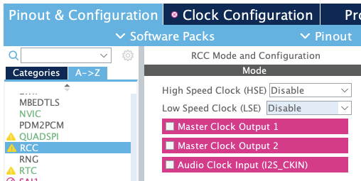

# 3 STM32CubeIDE 튜토리얼

> 실습은 STM32F746G 기판을 이용하여 진행했다.

MCU STM32F7 Series는 ST의 ART Accelerator $^{\mathrm{TM}}$ 와 L1 cache의 장점을 채용했다. code가 내장형 flash memory에서 실행되든 외부 memory에서 실행되든지 간에 Cortex-M7의 이론상 최대 성능을 제공한다.

> 216MHz fCPU에서 1082 CoreMark /462DMIPS).

모든 STM32 포트폴리오 라인에서는 그래픽 소프트웨어 구성 도구가 제공된다.


- STM32CubeMX

- STM32 IDEs

> IDE(Integrated Development Environment)는 통합 개발 환경을 의미하며, STM32CubeIDE를 이용해 실습을 진행할 것이다.

---

## 3.1 환경 설정

- STM32CubeIDE 실행 및 업데이트

실습은 /Users/{사용자 이름}/STM32CubeIDE/workspace 경로에서 진행할 것이다.(새로 디렉터리를 만들어서 선택)

> 먼저 상단 메뉴의 [Help] - [Check for Updates]를 눌러서 업데이트를 진행해 준다.

또한 ST사의 실습 보드에 내장된 ST-Link도 최신 펌웨어로 업데이트할 수 있다. [Help] - [ST-LINK Upgrade] 메뉴를 선택하면 나오는 창에서 하단의 Upgrade 버튼을 누르면 된다.(최신 버전이면 비활성화되어 있다.)


- Firmware Repository Folder 설정

/Users/{사용자 이름}/STM32Cube/Repository 디렉터리는 C code 생성에 필요한 압축 library가 저장된 위치이다. 

> STM32CubeIDE의 [Preference] 메뉴에 들어가서 [STM32Cube] - [Firmware Updater] 항목을 보면 해당 경로로 설정이 되어 있는 것을 확인할 수 있다.


실습에서는 앞서 workspace와 마찬가지로 상위 디렉터리를 STM32CubeIDE/로 두고, 하위에 Repository 경로를 만들어서 실습할 것이다.

- software package 설치

STM32CubeIDE의 [Help] - [Manage embedded software packages] 메뉴에 들어간다. 실습에 맞는 보드의 최신 버전의 패키지를 다운로드한다.(제일 상단만 체크)


- Terminal 통신 프로그램 설치

> [Window/MAC MCU 보드 Terminal 연결](https://master.d2s409snhlt74e.amplifyapp.com/lab0/module3/)

실습 및 시리얼 디버깅을 위해서는 PC에 시리얼 통신 프로그램이 필요하다.(책은 Tera term 프로그램을 이용.)

MAC OS에서는 다음과 같은 과정으로 설정을 진행했다.

1. 가상의 COM Port를 알아낸다.

```bash
ls /dev/tty* | grep usb
```

> 아두이노 보드나 USB to Serial Converter를 꽂으면 컴퓨터에서는 COM Port 번호를 배정한다.

2. Terminal에서 screen을 실행한다.

```bash
screen /dev/tty.usbmodem141203 115200
```

- /dev/tty.usbmodem141203는 1번에서 조회한 COM Port이다.

- 115200은 **Baud Rate**를 나타낸다.

여기서 Baud Rate(보 레이트)란 초당 얼마나 많은 **symbol**(의미 있는 데이터 묶음)을 전송하는지를 나타낸다. 데이터 전송 속도를 나타낼 때 사용하며 BPS(Bit Per Second)와 함께 metric으로 사용된다.

만약 하나의 신호에 bit 하나만 전달이 된다면 BPS와 Baud Rate는 동일할 것이다. 하지만 bit를 두 묶음(Di-Bit), 혹은 세 묶음(Tri-Bit)이나 네 묶음(Quad-Bit) 등으로 보내게 되면 달라지게 된다.

> 예를 들어 초당 최대 9600bit를 제공하며 10bit씩 묶어서 제공하는 경우, BPS는 9600이지만 Baud Rate는 9600/10=960이 된다.

> 표준으로 보통 110, 300, 600, 1200, 2400, 4800, 9600, 14400, 19200, 38400, 57600, 115200, 128000 및 256000bit를 사용한다. 하지만 CLK에 따라 Baud Rate가 높으면 [error rate가 상승하는 경우](https://m.blog.naver.com/PostView.naver?isHttpsRedirect=true&blogId=fresh841005&logNo=220890582994)도 있으니 주의해야 한다.

---

## 3.2 LED Blink

> [LED 개발환경 구축: LED Blink](https://ahnbk.com/?p=1192)

LED를 깜빡이는 기본 예제를 만들어 볼 것이다.

STM32CubeIDE를 실행해서 상단 메뉴의 [File] - [New] - [STM32 Project]를 클릭한다.

창이 뜨면 Board Selector를 누르고 Type과 MCU / MPU Series에서 알맞는 분류를 택한다.

> 현재 실습으로 사용하는 STM32F746G-DISCO는 Discovery Kit, STM32F7를 선택하면 된다.


[Next]를 누르면 Project 설정을 입력하는 창이 뜬다. Project Name은 "LED_Blink"를 입력하고 [Finish] 버튼을 누른다.


> 여러 설정을 묻는 창이 뜨면 모두 Yes를 누른다.

---

### 3.2.1 Pinout & configuration 설정

1. RCC 설정

> [[STM32F746G-DISCO] RCC (Reset and Clock Control) 알아보기
](https://rudalskim.tistory.com/266)



- LSE는 외부 저속 clock으로, 1MHz까지 사용할 수 있다.

  > STM32F746G-DISCO보드에서는 LSE는 32.768KHz로 RTC용으로 사용)

- HSE는 외부 고속 clock으로, 4~26MHz까지 사용할 수 있다.

  > STM32F746G-DISCO보드에서는 HSE는 25MHz 외부 클럭을 사용

좌측 Categories | A->Z 에서 RCC를 선택하고, HSE 및 LSE를 Disable로 바꾼다.

RCC(Reset Clock Controller)란 STM32의 reset과 clock을 관장하는 장치다.

2. GPIO 설정

마찬가지로 [GPIO] 카테고리를 선택하면 활성화되어 있는 GPIO peripheral 장치의 세부 설정을 확인할 수 있다.

> STM32F746G-DISCO 보드에는 D13에 LED가 장착되어 있다.

GPIO(general-purpose input/output)란 input과 output을 포함한 동작이 runtime 시 사용자에 의해 제어될 수 있는 디지털 신호 핀을 말한다. 

---

### 3.2.2 clock configuration 설정


- LSI는 내부 저속 clock으로 32KHz로 동작한다.

- HSI는 내부 고속 clock으로 16MHz로 동작한다.

- system clock은 최대 216MHz까지 사용할 수 있다.

- PCLK1은 최대 54MHz, PCLK2는 최대 108MHz까지 사용할 수 있다.

system clock 설정과 관련된 처리를 할 수 있다. 

---

### 3.2.3 generate code

이제 앞서 설정한 상태에 맞게 코드를 생성할 수 있다. 상단 [Project] - [Generate Code] 메뉴를 클릭하면 project source code가 자동으로 생성된다. 

> 앞서 설정한 정보를 바탕으로 clock 및 peripheral을 초기화하는 코드로 구성된다.

[Core] - [Src] - [main.c] 파일을 열어 보자. 


상단 [Build] - [Build Project] 메뉴를 실행해서(compile 및 link가 진행된다.), 에러나 경고 없이 정상적으로 빌드가 완료되는지 확인한다.


이제 LED가 깜빡이도록 source code를 작성해 보자. `HAL_Driver`에서 제공하는 function을 사용하면 된다.

**HAL**(Hardware Abstraction Layer) driver는 MCU register에 직접 값을 써넣거나 주변 장치를 제어하는 등의 동작을 맡는 software이다. hardware의 변화를 신호로 감지하고, 어떤 hardware architecture라도 software가 동작할 수 있게 만든다.

> 예를 들어 워드에서 문서를 프린트하려고 하는데 프린터가 바뀌었다고 하자. HAL이 있으면 워드 프로그램에 바뀐 프린터의 정보를 반영하지 않고도 출력이 가능하다.

이처럼 hardware가 달라지더라도 HAL만 다시 작성하면, OS의 다른 부분은 특별히 고칠 필요 없이 다시 compile만 진행하면 된다. 게다가 일관성 있는 인터페이스를 제공하기 위해, 같은 종류의 hardware를 공통 명령어 집합으로 묶어(**hardware abstraction**) 프로그래머가 다양한 장비로 개발하는 것을 도와준다.

> Repository의 [Drivers] - [STM32F7xx_HAL_Driver] - [Src] 폴더에 이런 function들이 정의되어 있다.

main.c source file에 다음과 같이 코드를 작성한다.

> main.h 파일([Core] - [Inc] -[main.h]) 내 LED port 및 pin 번호가 선언되어 있다.

```c
// ...
/* main() 내부 */
HAL_Init();

SystemClock_Config();

/* Initialize all configured peripherals */
MX_GPIO_Init();
MX_USART6_UART_Init();

/* Infinite loop */
/* USER CODE BEGIN WHILE */
while(1)
{
    HAL_GPIO_TogglePin(GPIOI, GPIO_PIN_1);
    HAL_Delay (500);
    /* USER CODE END WHILE */
}
```

- `HAL_Init()`: HAL 초기화 function으로, 관련 resource를 초기화하고 function들을 사용할 수 있게 한다.

- `SystemClock_Config()`: MCU의 system clock, 내부 clk, 외부 clk, 내부 oscillator 등을 설정해 주는 함수

- `MX_GPIO_Init()`: General Purpose Input/Output(GPIO) 초기화 함수.

  > GPIO는 embedded에서 일반적으로 사용하는 I/O port를 의미하고, 이 function을 호출하면 특정 GPIO를 입력 또는 출력으로 사용할 수 있다.

- `MX_USART6_UART_Init()`: Universal Asynchronous Receiver/Transmitter(UART) 초기화 함수. 

  > UART는 임베디드에서 일반적으로 사용하는, data를 직렬로 송수신할 수 있는 통신 프로토콜이다. 이 함수를 이용해서 MCU의 UART 포트를 초기화하게 된다.

- `HAL_GPIO_TogglePin()`: 해당 port의 pin의 출력을 toggle시켜주는 function. parameter로 해당 포트와 핀을 전달한다.

- `HAL_Delay()`: ms 단위로 delay를 주는 function

참고로 사용자 code를 입력할 때는 반드시 CubeMX에서 생성한 "USER CODE BEGIN"과 "USER CODE END" 주석 사이에 위치해야 GENERATE CODE를 다시 수행해도 사용자 코드가 사라지지 않는다.

코드 입력을 완료했다면 [Build] - [Build Project] 메뉴를 실행해서 빌드한다.

> 다음은 여러 hardware의 줄임말을 정리한 사진이다.


---

### 3.2.4 타깃 보드에 다운로드하여 실행

> Window라면 장치 관리자에서 ST-Link Debug 및 COM Port가 인식된 것을 확인할 수 있다.

상단 [Run] - [Run] 메뉴를 클릭하거나, Run 아이콘을 클릭한다. 클릭하면 launch configuration 창이 뜨는데 [OK]를 선택해 준다.

> 만약 ST-Link server가 필요하다는 에러가 발생하면 다음 링크를 눌러 설치한다. [ST-Link server software module](https://www.st.com/content/st_com/en/products/development-tools/software-development-tools/stm32-software-development-tools/stm32-performance-and-debuggers/st-link-server.html)

빌드가 정상적으로 완료되면 보드의 LED가 깜빡거리는 것을 확인할 수 있다.

---

### 3.2.5 타깃 보드에 다운로드하여 디버깅

compiler가 미처 잡아주지 못하거나 논리적 오류는 디버깅 과정을 통해 찾아내야 한다.

상단 [Run] - [Debug] 메뉴를 선택하고, 팝업 창에서 [Switch] 버튼을 누르면 Run과 마찬가지로 자동 빌드가 실행된다. 또한 Debug 화면으로 전환된다.

Debug 모드에서는 code를 한 줄씩 실행해 볼 수 있으며, Breakpoint를 지정해 지정된 point에서만 정지하여 code를 살펴볼 수도 있다.


> code line의 '숫자'를 우클릭하면 Breakpoint를 추가/삭제할 수 있다.

Toggle Breakpoint를 눌러 Breakpoint를 설정하면 왼쪽에 Breakpoint 표시가 나타난다.


그리고 재개 아이콘을 클릭하면 LED가 재개 아이콘을 누를 때마다 toggle되는 것을 확인할 수 있다. 

---