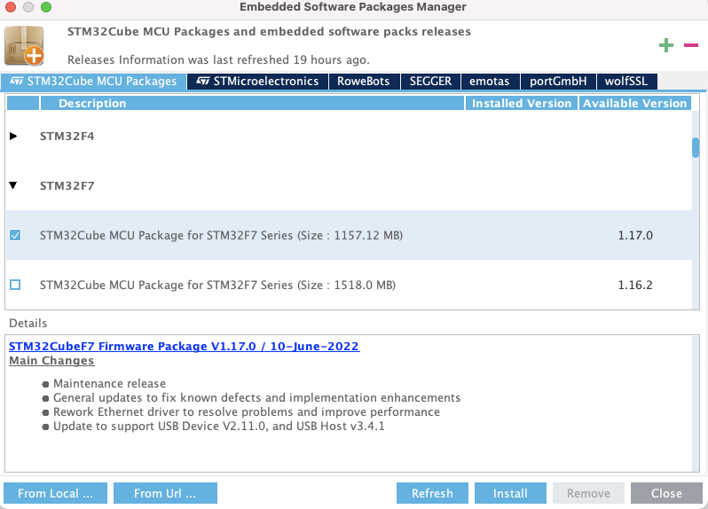

# 3 STM32CubeIDE 튜토리얼

> 실습은 STM32F746G 기판을 이용하여 진행했다.

MCU STM32F7 Series는 ST의 ART Accelerator $^{\mathrm{TM}}$ 와 L1 cache의 장점을 채용했다. code가 내장형 flash memory에서 실행되든 외부 memory에서 실행되든지 간에 Cortex-M7의 이론상 최대 성능을 제공한다.

> 216MHz fCPU에서 1082 CoreMark /462DMIPS).

모든 STM32 포트폴리오 라인에서는 그래픽 소프트웨어 구성 도구가 제공된다.


- STM32CubeMX

- STM32 IDEs

> IDE(Integrated Development Environment)는 통합 개발 환경을 의미하며, STM32CubeIDE를 이용해 실습을 진행할 것이다.

---

## 3.1 환경 설정

- STM32CubeIDE 실행 및 업데이트

실습은 /Users/{사용자 이름}/STM32CubeIDE/workspace 경로에서 진행할 것이다.(새로 디렉터리를 만들어서 선택)

> 먼저 상단 메뉴의 [Help] - [Check for Updates]를 눌러서 업데이트를 진행해 준다.

또한 ST사의 실습 보드에 내장된 ST-Link도 최신 펌웨어로 업데이트할 수 있다. [Help] - [ST-LINK Upgrade] 메뉴를 선택하면 나오는 창에서 하단의 Upgrade 버튼을 누르면 된다.(최신 버전이면 비활성화되어 있다.)


- Firmware Repository Folder 설정

/Users/{사용자 이름}/STM32Cube/Repository 디렉터리는 C code 생성에 필요한 압축 library가 저장된 위치이다. 

> STM32CubeIDE의 [Preference] 메뉴에 들어가서 [STM32Cube] - [Firmware Updater] 항목을 보면 해당 경로로 설정이 되어 있는 것을 확인할 수 있다.


실습에서는 앞서 workspace와 마찬가지로 상위 디렉터리를 STM32CubeIDE/로 두고, 하위에 Repository 경로를 만들어서 실습할 것이다.

- software package 설치

STM32CubeIDE의 [Help] - [Manage embedded software packages] 메뉴에 들어간다. 실습에 맞는 보드의 최신 버전의 패키지를 다운로드한다.(제일 상단만 체크)



- Terminal 통신 프로그램 설치

> [Window/MAC MCU 보드 Terminal 연결](https://master.d2s409snhlt74e.amplifyapp.com/lab0/module3/)

실습 및 시리얼 디버깅을 위해서는 PC에 시리얼 통신 프로그램이 필요하다.(책은 Tera term 프로그램을 이용.)

MAC OS에서는 다음과 같은 과정으로 설정을 진행했다.

1. 가상의 COM Port를 알아낸다.

```bash
ls /dev/tty* | grep usb
```

> 아두이노 보드나 USB to Serial Converter를 꽂으면 컴퓨터에서는 COM Port 번호를 배정한다.

2. Terminal에서 screen을 실행한다.

```bash
screen /dev/tty.usbmodem141203 115200
```

- /dev/tty.usbmodem141203는 1번에서 조회한 COM Port이다.

- 115200은 **Baud Rate**를 나타낸다.

여기서 Baud Rate(보 레이트)란 초당 얼마나 많은 **symbol**(의미 있는 데이터 묶음)을 전송하는지를 나타낸다. 데이터 전송 속도를 나타낼 때 사용하며 BPS(Bit Per Second)와 함께 metric으로 사용된다.

만약 하나의 신호에 bit 하나만 전달이 된다면 BPS와 Baud Rate는 동일할 것이다. 하지만 bit를 두 묶음(Di-Bit), 혹은 세 묶음(Tri-Bit)이나 네 묶음(Quad-Bit) 등으로 보내게 되면 달라지게 된다.

> 예를 들어 초당 최대 9600bit를 제공하며 10bit씩 묶어서 제공하는 경우, BPS는 9600이지만 Baud Rate는 9600/10=960이 된다.

> 표준으로 보통 110, 300, 600, 1200, 2400, 4800, 9600, 14400, 19200, 38400, 57600, 115200, 128000 및 256000bit를 사용한다. 하지만 CLK에 따라 Baud Rate가 높으면 [error rate가 상승하는 경우](https://m.blog.naver.com/PostView.naver?isHttpsRedirect=true&blogId=fresh841005&logNo=220890582994)도 있으니 주의해야 한다.

---
